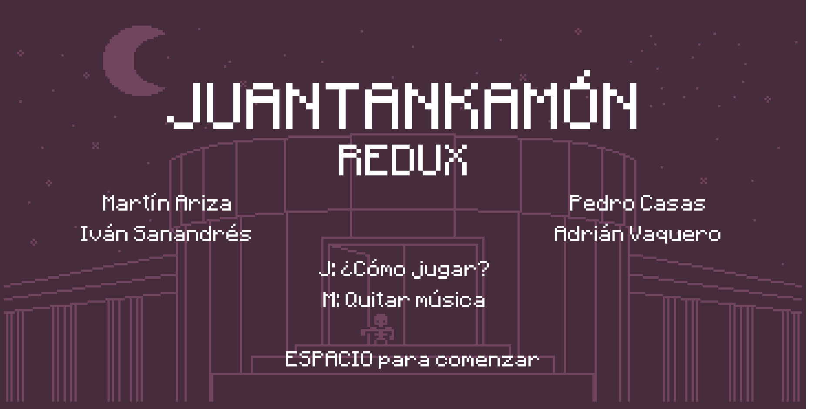
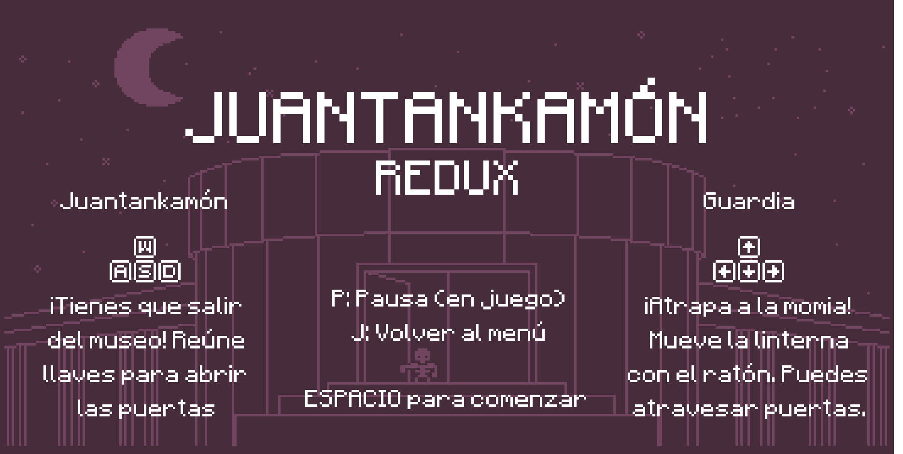
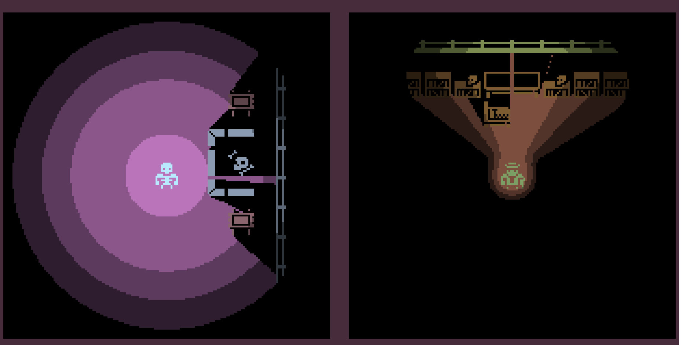
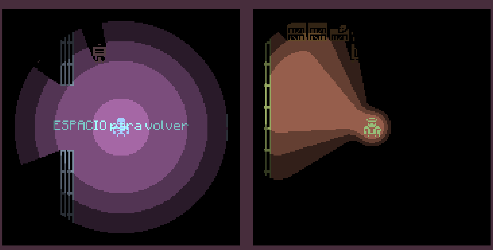
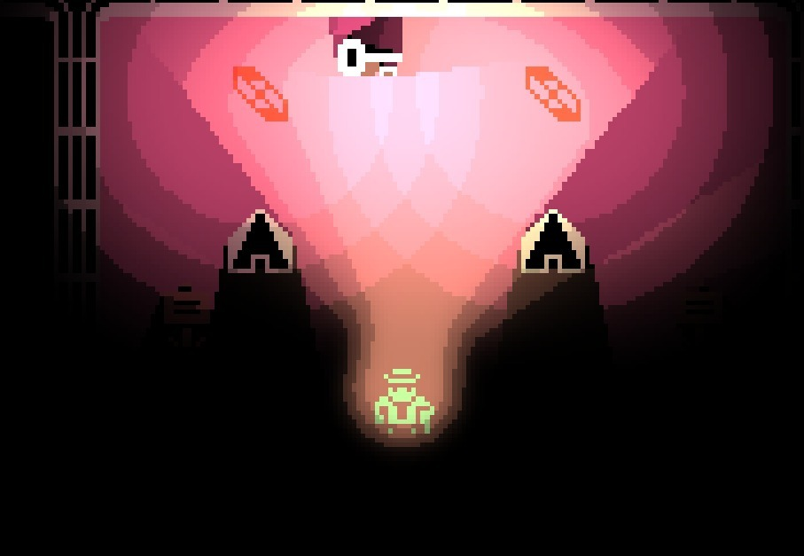
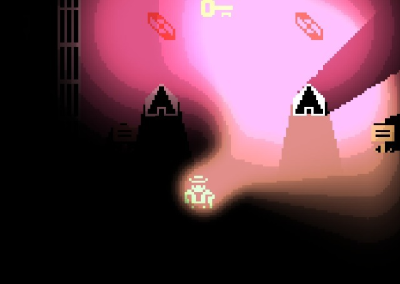
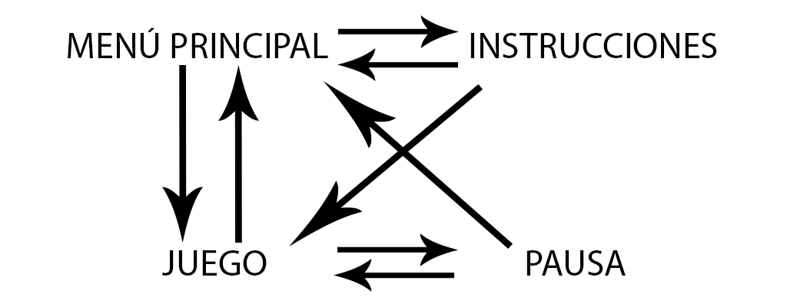
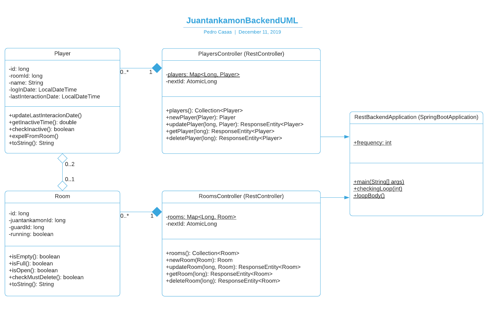
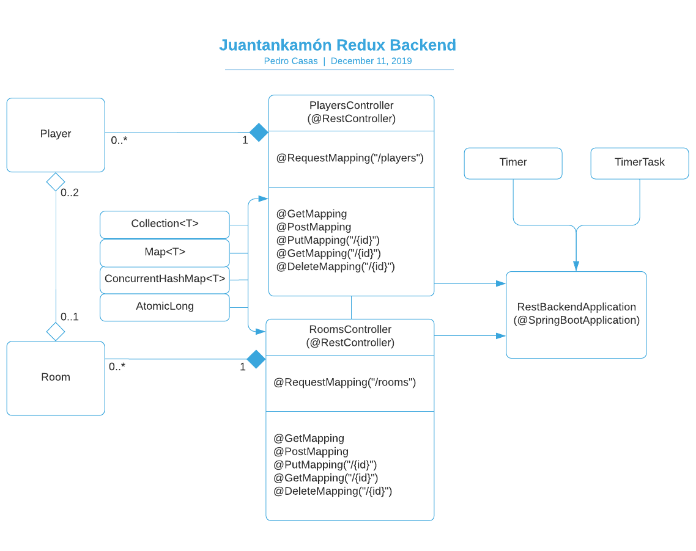

# Juegos_Red

------------------------------------------------------------------------------------------------------------------

## GAME DESIGN DOCUMENT Juantankamón Redux (Versión 3.0)

###### Autores:  [Adrián Vaquero Portillo](https://github.com/adrvapor "Git de Adrián Vaquero Portillo") Correo: a.vaquero.2017@alumnos.urjc.es  [Iván Sanandrés Gutiérrez](https://github.com/Ivan-Sanandres "Git de Iván Sanandrés Gutiérrez") Correo: i.sanandres.2017@alumnos.urjc.es  [Martín Ariza García](https://github.com/Daoab "Git de Martín Ariza García") Correo: m.ariza.2017@alumnos.urjc.es  [Pedro Casas Martínez](https://github.com/thePeter876 "Git de Pedro Casas Martínez") Correo: p.casas.2017@alumnos.urjc.es  [Tablero de Trello](https://trello.com/b/K7lkKa6A/juegos-en-red) [Repositorio de GitHub](https://github.com/Ivan-Sanandres/Juegos_Red)

### Índice
1. Historial de versiones
2. Objetivos del juego
3. Sinopsis de la historia
4. Controles
5. Requisitos técnicos
6. Instrucciones previas para ejecutar la aplicación
7. Cámara
8. Mecánicas
9. Niveles de juego
10. Apartado gráfico
11. Pantallas del juego
12. Aspectos desarrollados en la Fase 2
13. Aspectos desarrollados en la Fase 3
14. Detalles clave de la implementación
15. Bibliografía y créditos

### Historial de versiones
#### Versión 1.0:
Creación del documento de diseño del juego. Se han añadido los siguientes apartados:  
* Historial de versiones
* Objetivos del juego
* Sinopsis de la historia
* Controles
* Requisitos técnicos
* Cámara
*	Mecánicas
*	Niveles del juego
*	Apartado gráfico

#### Versión 2.0:
Se ha desarrollado la versión local del juego. Se han modificado los siguientes apartados:  
*	Objetivos del juego
*	Controles
*	Requisitos técnicos
*	Mecánicas
*	Niveles del juego

Y añadido los siguientes apartados:
* Aspectos desarrollados en la Fase 2
* Detalles clave de la implementación
* Bibliografía y créditos

#### Versión 3.0
Se ha desarrollado la API REST que gestiona las salas creadas y los jugadores conectados. Se han modificado los siguientes apartados:
* Controles
* Requisitos técnicos
* Pantallas del juego
* Detalles clave de la implementación
* Bibliografía y créditos

Y añadido los siguientes apartados:
* Instrucciones previas para ejecutar la aplicación
* Aspectos desarrollados en la Fase 3

También se ha reformateado el documento para una mayor consistencia.

### Objetivos del juego
Crear un juego en red que emplee el modelo cliente-servidor de forma que dos clientes puedan jugar en la misma partida mediante el servidor.
Ofrecer una experiencia multijugador asimétrica que sea divertida y satisfactoria para ambas partes.

### Sinopsis de la historia
Juantankamón es una momia de un museo que cobra vida repentinamente y tiene como objetivo escapar antes de que abra el museo por la mañana.
Sin embargo, no será tarea fácil, ya que deberá esquivar al guardia de seguridad que patrulla el museo por la noche.

### Controles

* M - Silenciar la música

#### Juantankamón
*	W - Movimiento hacia arriba
*	A - Movimiento hacia la izquierda
*	S - Movimiento hacia abajo
*	D - Movimiento hacia la derecha

#### Guardia
* **Modo local:**
    * 🠙 - Movimiento hacia arriba
    * 🠘 - Movimiento hacia la izquierda
    * 🠛 - Movimiento hacia abajo
    * 🠚 - Movimiento hacia la derecha
* **Modo online:**
    *	W - Movimiento hacia arriba
    *	A - Movimiento hacia la izquierda
    *	S - Movimiento hacia abajo
    *	D - Movimiento hacia la derecha
*	Movimiento de ratón - Girar la linterna

_VERSIÓN 3.0: Cabe destacar que se han cambiado las teclas de navegación por los niveles por botones que se pulsan con el ratón, algo que resulta más intuitivo que memorizar qué tecla pulsar para cada cosa._

### Requisitos técnicos
Para jugar al videojuego se necesitan dos ordenadores, uno por cada jugador, con navegadores instalados que soporten Phaser 3 y una conexión a internet. También es posible jugar dos jugadores en una sola pantalla en el modo local.

_VERSIÓN 3.0: Se podría considerar un nuevo requisito técnico que un ordenador esté ejecutando la API REST en un equipo, de forma que los jugadores que deseen jugar se conecten a dicha máquina en el puerto indicado. Se explica cómo ejecutar esta API REST en el siguiente apartado._

### Instrucciones previas para ejecutar la aplicación
Es necesario que en el equipo que hará las veces de servidor esté instalado 

### Cámara
Cámara cenital que sigue a cada uno de los personajes mostrando una porción del mapa a cada uno.

### Mecánicas
*	Juantankamón podrá recoger llaves para abrir las distintas puertas del museo
* Juantankamón, gracias a sus poderes, es capaz de ver en la oscuridad (el jugador podrá ver todas casi todas las tiles que muestre la cámara)
*	Juantankamón deberá llegar a la entrada del museo para escapar y ganar la partida
*	El guardia contará con una linterna para poder ver en la oscuridad (el jugador sólo podrá ver las tiles que estén dentro del alcance de la luz de la linterna)
*	El guardia deberá capturar a Juantankamón alcanzándolo. (El guardia tiene una mayor velocidad de movimiento que Juantankamón)

### Niveles de juego
Hay un único nivel del juego, desarrollado en el museo de donde tendrá que escapar Juantankamón mientras el guardia le da caza. Hay también otro nivel que se usa exclusivamente para el menú principal, en el que también se pueden ver créditos e instrucciones.

### Apartado gráfico
Se utilizará un estilo 1-bit mediante los assets con licencia CCO 1.0 Universal del artista Kenney. (https://kenney.nl/assets/bit-pack)
Para la iluminación hemos desarrollado un shader de iluminación y sombreado.

### Pantallas del juego

> Esta es la pantalla del menú principal del juego, en la que se pueden ver los nombres de los desarrolladores, el título del juego, y las teclas que se pueden utilizar para pasar a otras pantallas.

> Esta pantalla muestra las instrucciones del juego. Esto incluye las teclas de movimiento de los personajes, así como cuáles son los objetivos de cada uno. También se indican las teclas usadas para pasar a otras pantallas.

> Esta es la pantalla de juego. Al estar jugando localmente ambos jugadores en esta fase, se ha optado por utilizar una pantalla partida, mostrando la de la izquierda a Juantankamón, y la de la derecha al guardia.

> Esta es la pantalla de pausa.

> Aquí se ve la iluminación de la Versión 2.0. Se puede observar que los niveles de las luces no se mezclan y están muy marcados

> Aquí se ve la iluminación de la Versión 3.0. Se puede observar la implementación de bloom y blending, puesto que las luces son más intensas y los niveles tienen cierta interpolación, además de que los niveles de diferentes luces se mezclan.

>Finalmente, aquí se puede ver el diagrama de navegación de las distintas pantallas en la Versión 3.

### Aspectos desarrollados en la Fase 2
En esta fase del desarrollo se ha creado un juego en navegador para dos jugadores en pantalla partida. Está programado en JavaScript, utilizando el framework para videojuegos Phaser 3. Está dividido en dos escenas de Phaser: Menu, que ofrece información sobre cómo jugar, y LocalGame, que incluye todo lo relacionado con el modo de juego local.

Los diferentes aspectos que se han desarrollado son:
* Movimiento de los personajes
* Eventos de colisión
* Sistema de iluminación y sombreado
* Sistema de escenas
* Diseño e implementación del nivel
* Implementación de sonido

### Aspectos desarrollados en la Fase 3
En esta fase del desarrollo se ha creado una API REST en Java que permite logearse en el servidor y guardar los datos del jugador (nombre único de 12 caracteres máximo que introduce el jugador e ID asignada automáticamente). También permite crear partidas y guardar los datos de aquellas que están en ejecución o esperan un jugador. Se ha mantenido la escena LocalGame si se quiere jugar en pantalla partida, y se ha añadido otra llamada OnlineGame para jugar online, si bien por ahora no se actualiza la posición del adversario (a implementar en la siguiente fase con Websockets). También se han añadido las escenas correspondientes a introducir el nombre del jugador, crear o escoger partidas, esperar a que entre un jugador a la partida creada y el final del juego. Por último, se ha añadido la funcionalidad de terminar la conexión con un jugador si este pasa un determinado tiempo sin interactuar con el juego.

Los diferentes aspectos que se han desarrollado son:
* Backend desarrollado en Java con Spring
* Peticiones AJAX en el cliente con JQuery
* Varias nuevas escenas (menús, juego online, final de partida)
* Sustitución de las teclas de la interfaz por botones para ratón
* Sprites propios, animados para los personajes, y cursores personalizados
* Blending entre luces y bloom.
* Hoja de estilos CSS

### Detalles clave de la implementación
#### SHADER
Se ha desarrollado un shader de postproceso para la cámara que permite la iluminación dinámica del juego, generando también sombras.

El shader usa trazado de rayos para calcular las sombras proyectadas por los objetos, se usa el canal R de color de las texturas para saber qué objetos son traslúcidos y cuáles no.

Permite incluir el número que deseemos de luces, aunque está limitado a 19 como máximo en el shader (pero es algo que se puede aumentar si es necesario).

Además se han creado dos funciones (Light_focal, LightingManager) que permiten gestionar la creación y renderizado de luces para las distintas cámaras del juego, siendo posible que cada cámara tenga unas luces particulares.

_VERSIÓN 3.0: Se ha optimizado el shader, evitando accesos a textura innecesarios. Además se ha incorporado bloom, conseguido mezclando la intensidad de la luz con ella misma dividida en niveles; y blending entre distintas luces, conseguido por calcular la división por niveles para todas las luces globalmente en lugar de por cada luz, que además es más óptimo._

#### BACKEND
El backend espera peticiones de los clientes, y crea objetos Room y Player, que se corresponden con los jugadores y las salas del cliente, almacenados en mapas hash que permiten acceso concurrente.

El backend está creado en base a un modelo relacional, de forma que estas dos clases tienen una referencia cruzada: una habitación tiene el ID de los jugadores que la ocupan, y los jugadores tienen el ID de la habitación en la que están.

Además, se hace una comprobación periódica de las habitaciones y los jugadores, de forma que se eliminan las instancias de habitaciones vacías y jugadores que llevan demasiado tiempo sin interactuar (eliminando previamente su referencia de la habitación en la que se encontraba).

Para un mejor entendimiento del backend, hemos creado una diagrama UML:

También hemos creado un diagrama de relaciones entre las distintas clases, así como el uso de API Rest en ellas:

### Bibliografía y créditos
#### Programas usados
* Atom, VS Code: IDEs para programación  
* Sourcetree, GitHub Desktop: Gestión del repositorio.  
* Piskel, Photoshop: Creación y edición de sprites.  
* Tiled: Creación del mapa, colisiones, spawn points...  
* Trello: Gestión del proyecto (TO DO, DOING, DONE).  

#### Assets usados
* Fuente texto: https://www.dafont.com/es/minecraftia.font?text=JUANTANKAM%D3N&back=bitmap
* Tilesheet 1-bit:https://www.kenney.nl/assets/bit-pack
* Música menú: https://opengameart.org/content/perpetual-tension
* Música juego: https://opengameart.org/content/kokopellis-graveyard-theme

#### Assets creados
* Mapa (no las tiles, sino su disposición y diseño de habitaciones)
* Sprites animados (creadps a partir de los sprites originales de Kenney)
* Fondos de los menús
* Iconos de las teclas
* Cursores personalizados
* Botones de la interfaz

#### Bibliografía
* Explicación sobre shaders en Phaser 3: https://www.dynetisgames.com/2018/12/09/shaders-phaser-3/
* Explicación sobre crear mapas en Tiled e integrarlos en Phaser 3: https://stackabuse.com/phaser-3-and-tiled-building-a-platformer/
* Explicación sobre tilemaps en Phaser 3: https://medium.com/@michaelwesthadley/modular-game-worlds-in-phaser-3-tilemaps-1-958fc7e6bbd6
* Vídeo tutorial sobre crear mapas en Tiled e integrarlos en Phaser 3:https://www.youtube.com/watch?v=2_x1dOvgF1E
* Vídeo tutorial sobre tilemaps en Phaser 3: https://www.youtube.com/watch?v=uznkhVMbVr8
* Documentación sobre Phaser 3: https://rexrainbow.github.io/phaser3-rex-notes/docs/site/index.html
* Documentación sobre Phaser 3: https://photonstorm.github.io/phaser3-docs/
* Documentación sobre HTML/CSS: https://developer.mozilla.org/en-US/docs/Web
* Documentación sobre HTML/CSS: https://www.w3schools.com
